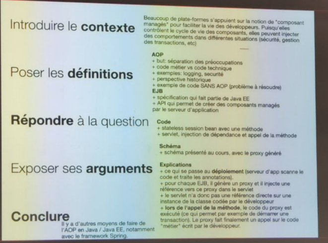

# Welcome to AMT 2020

## Week 2

* **Objectives**

  * Be able to explain what it means for a component to be "managed" and by "what" components are managed.
  * Be able to explain what dependency injection means in object-oriented programming.
  * Be able to explain how dependency injection can be implemented "from scratch". See https://github.com/SoftEng-HEIGVD/Teaching-HEIGVD-AMT-Dependency-Injection
  * Be able to explain how dependency injection is implemented in the Java EE / Jakarta EE platform.
  * Be able to explain what Aspect Oriented Programming (AOP) is.
  * Be able to explain the relationship between AOP, managed components and dependency injection.

* **Project**

  * Replace Payara / Wildfly with Open Liberty, a modern implementation of Jakarta EE (see [this webcast](https://www.youtube.com/watch?v=fJI_9VArhtY&list=PLfKkysTy70QZe0fhUhZmR64ZPUIFpN4MJ&index=1&t=733s))
  * Study the reference architecture described in [this](https://www.youtube.com/watch?v=Yr7OeHtefvQ&list=PLfKkysTy70QZe0fhUhZmR64ZPUIFpN4MJ&index=3) and [this](https://www.youtube.com/watch?v=SW9YFmC_va0&list=PLfKkysTy70QZe0fhUhZmR64ZPUIFpN4MJ&index=4) webcast, which provides the overall structure for your application across all tiers.
  * Reuse the code you wrote during the first week.
  * Make sure that your CodeceptJS tests still work and extend them.
  * Implement a new feature (users can ask questions)
  * Implement a first continuous integration pipeline with GitHub Actions (build and publish a Docker image as described in [this webcast](https://www.youtube.com/watch?v=jrTIZBMmqhI&list=PLfKkysTy70QZe0fhUhZmR64ZPUIFpN4MJ&index=2&t=8s)).

* **The Question of the Week**: 

  * *Expliquez comment les Enterprise Java Beans (EJBs) permettent d'appliquer les principes de la programmation orientée aspects (AOP). Appuyez-vous sur un exemple de code et expliquez en détails ce qui se passe "derrière les décors" (i.e. expliquez ce que le serveur d'application fait).*

Context : beaucoup de plate-formes s'appuient sur la notion de "composants managés" pour faciliter la vies des développeurs. Puisqu'elles contôlent le cycles de vie des composants, elles peuvent injecter des comportement dans différentes situations (sécu, gestion des transactions...)

Définitions : 
  * AOP : but -> séparation des préoccupations, code metier vs code technique, ex -> logging, sécu. Perspective historique ex de code sans AOP -> pd à résoudre
  * EJB : spécification que fait partie de JavaEE, API qui permet de créer des composants managés par le serveurd'application

* **Notes about the YouTube Playlist:**

  * I have added 4 videos (see the links in the Project paragraph just above).